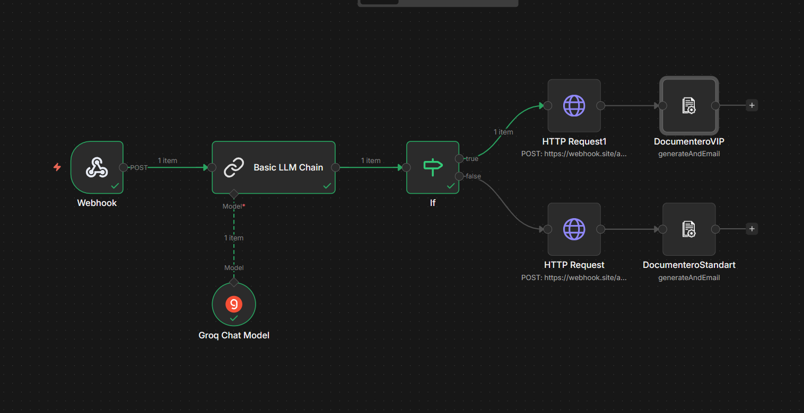

# FinServe Lead-to-Memo Automation Pipeline

An end-to-end AI automation workflow built in **n8n** that solves a real operational bottleneck in loan origination: manual data entry and unsegmented application processing.

## The Problem

In a typical loan origination process, incoming requests are unstructured (emails, portal submissions). Staff manually read these requests, guess their priority, re-key data into a CRM, and draft credit memos by hand. High-value "VIP" requests end up stuck in the same slow pipeline as standard ones, risking delays for premium clients.

## The Solution

This workflow automates the entire pipeline from intake to document generation:

1. **Ingestion** — A Webhook node receives raw, unstructured loan request emails.
2. **Data Extraction** — A Groq-powered LLM (Llama 3) parses the email and extracts structured financial data (company name, industry, requested loan amount, annual revenue) into JSON.
3. **Dynamic Routing** — An IF node evaluates the requested loan amount. Requests above $1,000,000 are routed to a "VIP" branch; everything else goes to "Standard."
4. **CRM Sync** — HTTP Request nodes push the structured data to the appropriate CRM endpoint based on the routing decision.
5. **Document Generation** — Documentero nodes auto-generate the correct PDF (High-Priority Credit Memo vs. General Assessment) and email it to the relevant review committee.

## Why Groq Instead of OpenAI/Gemini

I initially tested OpenAI and Gemini for the data extraction step. Both produced inconsistent JSON formatting and occasional timeout/rate-limit issues — unacceptable in a high-volume origination environment where reliability matters. Groq's LPU architecture (running Llama 3) delivered near-instant, consistently formatted JSON output, which solved both the latency and parsing problems.

## Tech Stack

- **n8n** (self-hosted via Docker) — workflow orchestration
- **Groq (Llama 3)** — LLM for structured data extraction
- **Documentero** — automated PDF generation
- **Webhook / HTTP Request nodes** — integration layer

## Why n8n

I chose n8n over alternatives because its visual, node-based structure made it fast to iterate on API integrations and debug each step in isolation — critical once I started hitting LLM provider issues and needed to swap models without rebuilding the whole pipeline.

## Workflow Diagram

`workflow.json` (n8n export) is included in this repo and can be imported directly into any n8n instance.

`workflow.json` (n8n export) is included in this repo and can be imported directly into any n8n instance.

## Future Extensions

- Slack/Teams integration for real-time alerts on VIP leads
- KYC/AML compliance check via third-party API before memo generation
- PostgreSQL/Snowflake sink for centralized BI reporting
- A parallel RAG-based support copilot using LangChain + a vector database

*This project was built as part of a take-home assessment for a financial AI automation role.*
